# Portobello gym -website
---
A website of a gym/health club to show its facilities and show why to join it.

## General info
An small web project for Frontend Developmentor part of training needs.

## Technologies

### Languages  
* HTML
* CSS

#### Project Tools:
* Bootstrap version: 5.2
* Google fonts 
* Gitpod
* Git
* Font Awsome
* VS.code

## Prerequisites recomended
* Install Gitpod (for more info please go to this link https://www.gitpod.io/docs/getting-started/ )
* vscode

# Project Goals

### User needs
* Finding a GYM that offers a nice place to train and spend qulity time
* See facilities .
* Find information about the GYM.
* Find the location of the GYM

### Site Owner Main Goals
* Increase in the number of member.
* Promote the bussines.
* Provide a way for new and existing customers to contact the buissnes.
* Provide essential information about the bussines to customers.

### User Experience
* Target Audience
* People looking for a place to dine at
* People looking to order take away
* Groups of people looking for a place to carter a event
* Small to medium wedding parties
### User Requrements and Expectations
* A simple and intuitive navigation system
* Quickly and easily find relevant information
* Links and functions that work as expected
* Good presentation and a visually appealing design regardless of screen size
* An easy way to contact the bussines
* Accessibility

# User Stories
### First-time User
1. As a first time user, I want to know where the GYM is lokated
2. As a first time user, I want to know more about the GYM
3. As a first time user, I want to know the Membership prices
4. As a first time user, I want to get a feel of what to expect at the restaurant
### Returning User
1.As a returnign user, I want to know the opening times
2.As a returning user, I want to leave some comment, suggestion or message to the staff
3.As a returning user, I want to find the GYM on social media
4.As a returning user, I want to get directions to the GYM
### Site Owner
1.As the site owner, I want users to find news about upcoming events or changes in opening times
2.As the site owner, I want users to get to know the GYM
3.As the site owner, I want the users to be able to contact us

# Design Choices

home page’s web design influences whole on line presence. so this page designed withe feeling of customer in mind, make sure to show what they will get in this gym.
so designed withe video and photo slides

# wireframes
 
 ### first come up with differnt style and focus was more on photos carousel (wirefram at below) then changed to the current one.for map as well aproach was more toward simple square but wasnt that easy to manage on mobile so instead use cards and inframe provided by google
   
    

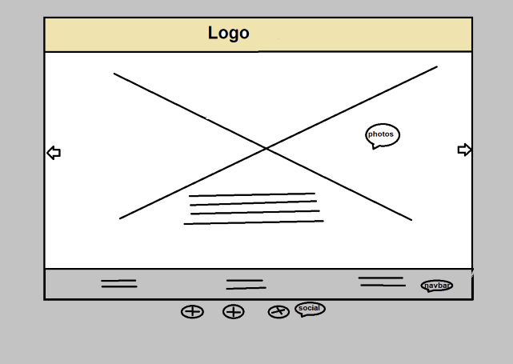 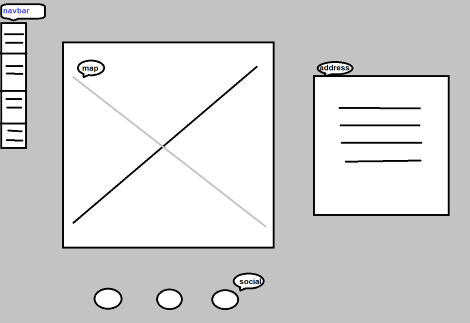

* <small> for wireframing used windows simple paint app</small>
 

### current design wrieframe and for but here you see desktop version

*  index page                                                      
*  Join Page

  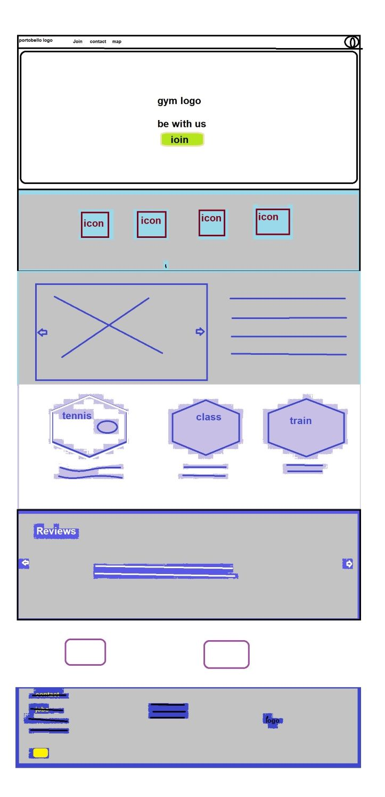 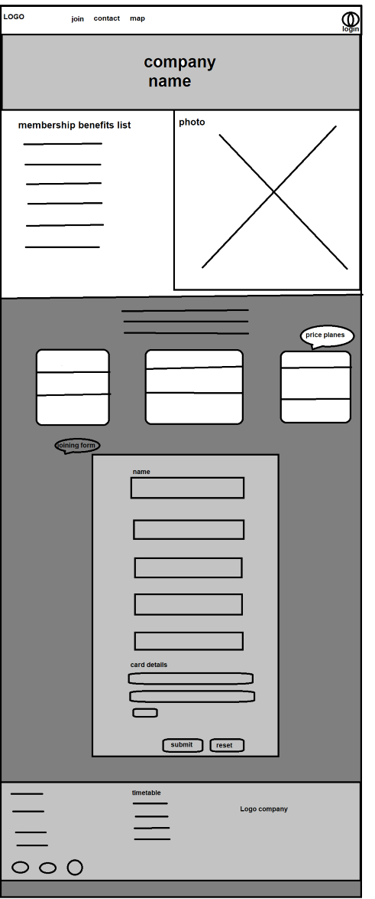
      

* map page
* Join page 

  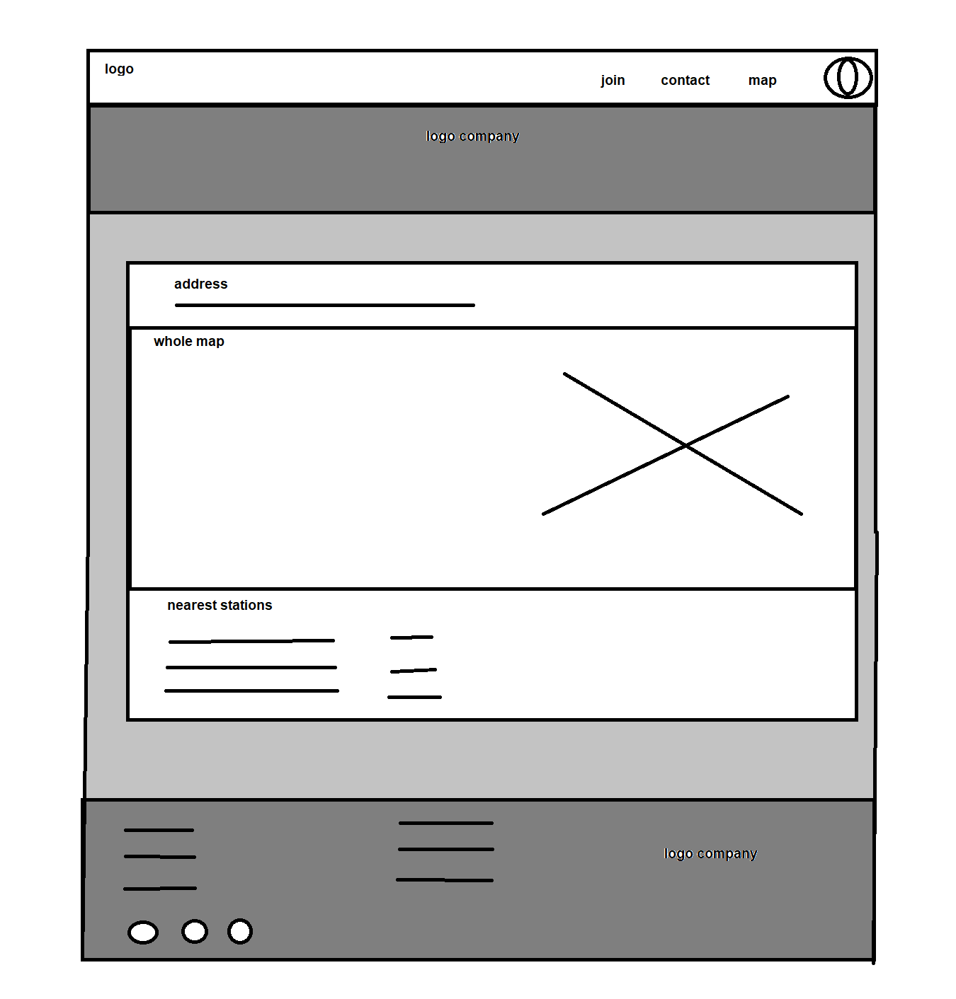 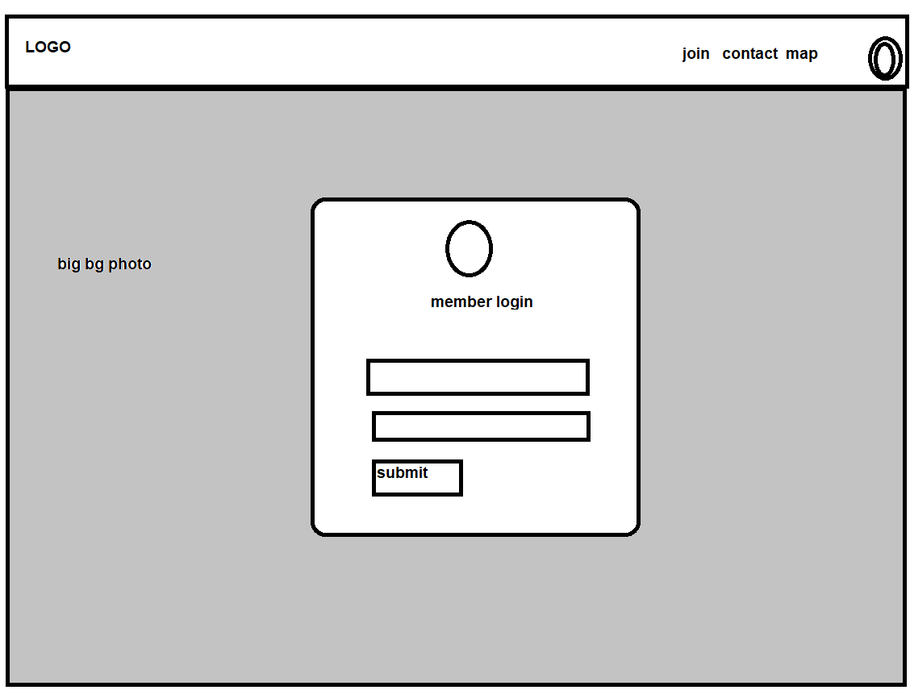
     

  
    

# Structure
The page is structured in a well know, recognizable, user friendly, and easy to learn way. 
Upon arriving the user sees a familiar type of navigation bar with the GYM name logo on the left side and the navigation links on the right. The website consists of three separate pages and a modal link for contact

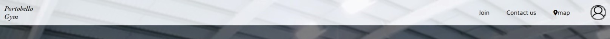

* A Logo link for homepage with a sections of Gym video and photos of facilities , reviews and special tennis class 
* A Join page with sections for benefits, membership price planes and Form to fill to join 
* A contact us is modal form to contact GYM
* A map page consist of Address and how to find the GYM  
* A Login icon link of a page for existing member to login 

# sample photos and pages Features

## Homepage 

01.The navigation bar has a consistent look and placement on all three pages of the website supporting easy navigation. 
It includes a Logo, Join and Contact us modal link and map link and is responsive on multiple screen sizes but for mobile
login icon will be hidden and login link will show up. 

   * the navigaiton bar is same for all three pages

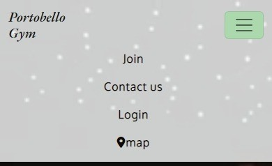

02.The Homepage Landing Page includes a short video of gym and JOIN button and a text overlay that tell why to join and persuade page visitor
    to click join button 
    
    
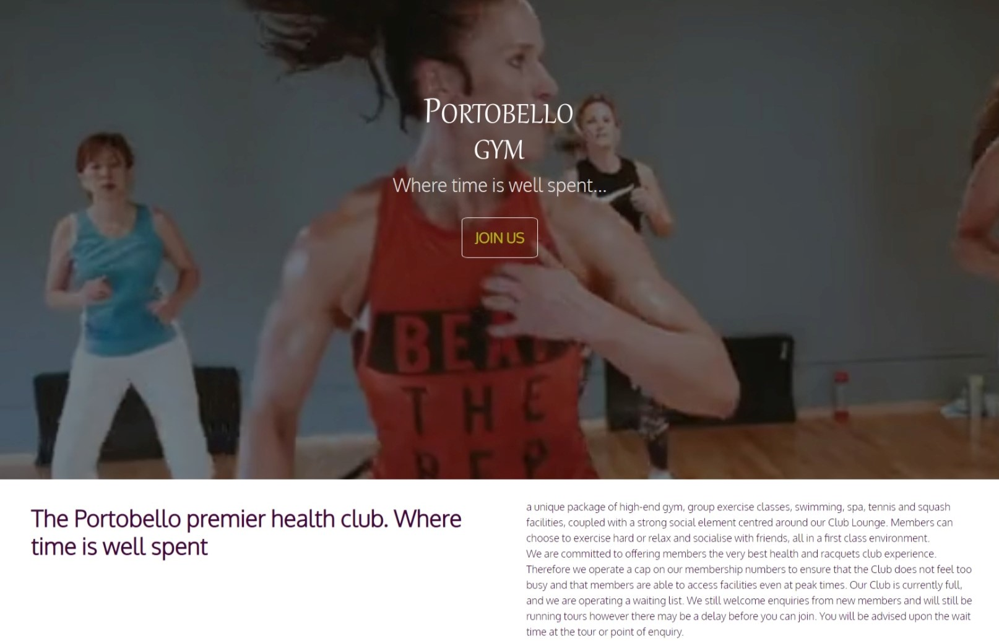

  
  
03.In the Homepage next sections explain the text overlay and what facilities the gym has, 
 also it contain #slideshow of parts of the gym include yoga classes

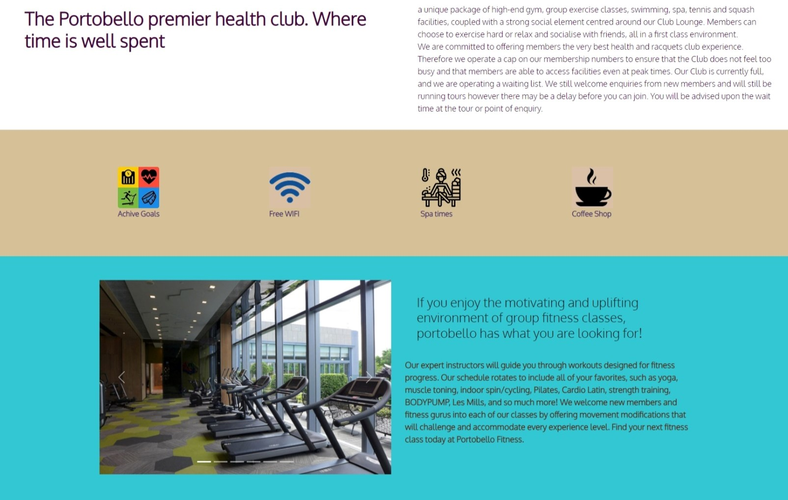

04.At next section of Homepage Allowes users to see the facility not all GYMs have ,tennis court ,special part of gym with small info about
this facility fees and classes for tennis . 

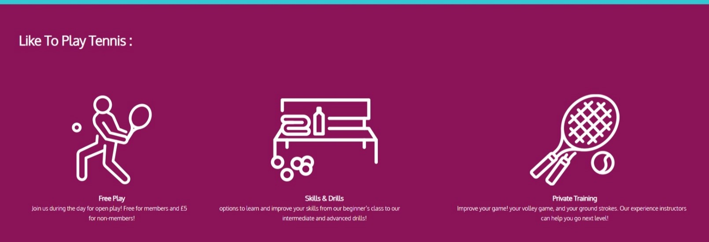

  * but only first image will in mobile view
  
 05.The Homepage next section is a Carousel of customer Reviews of gym to show some good point of gym
    and stars image to tell overal score ,perhaps this pursued first time visitor to click buttons on next section of page after see tennis facility and  customer reviews.
    
  06.as mentioned on next secion ,placed two buttons to make it easier for visitor  to either press Join or if they have a question make an enquiry 
    
   
   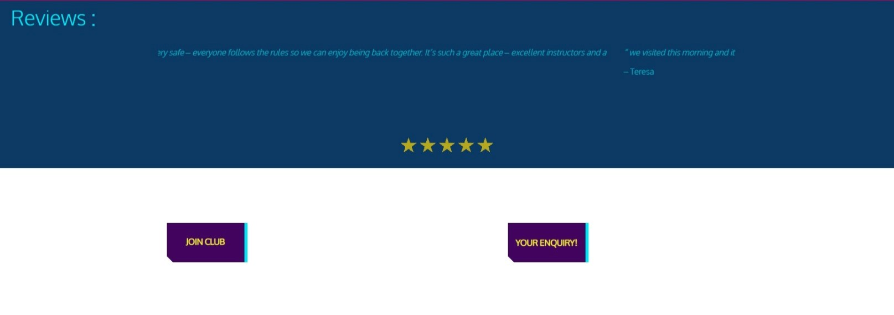
    
07. Last part of Homepage is footer 
 
* The footer is featured on all three pages and is identical on each page making it easy to use. It contains three column section :
  * Stay in Touch - this area has links to write or phone the Gym and links to social media sites associated with the organisation encouraging the user to keep connected. The links will open in a new tab to allow easy navigation for the user. The organisation can use these sites to promote brand awareness and keep customers interested through updates, offers, chats and other marketing efforts
  
  * Opening Times - having the opening times in the footer on each page allows the user to quickly and easily find this information. 
  * The name of the Gym to repeat it for visitor and become more familiar with the name.

  * Place a ancher icon at right side of footer  for bring back visitor to top of page faster 
  
  
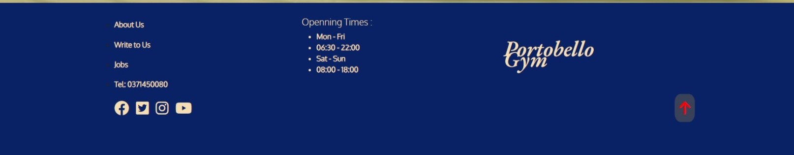

      

#### homepage desktop and mobile views photos
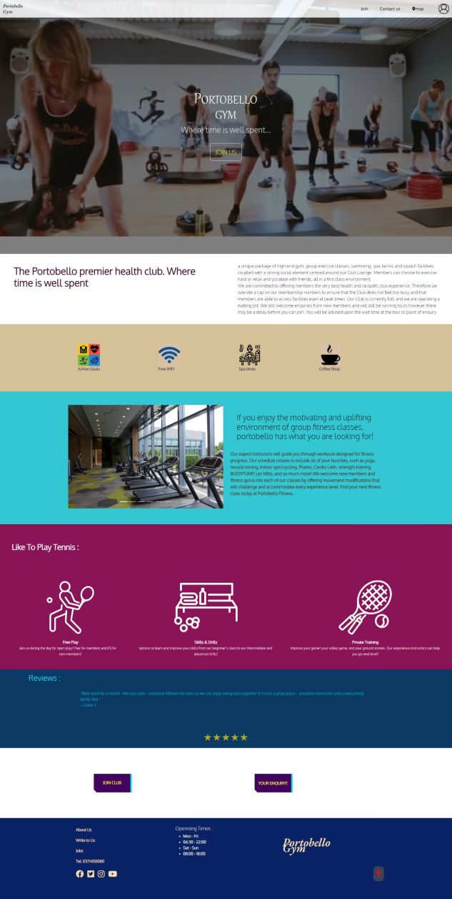 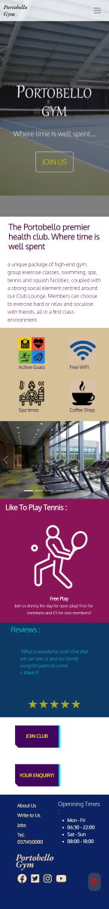

  ### JOIN PAGE
  
  01. At first part there is logo and Under it used blink feature to show current offer and visitor of page by press it move to join form
  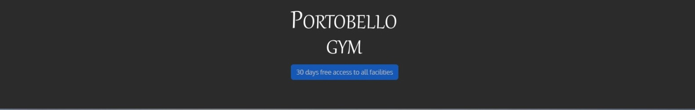
  
  02.second part featured list of member benefits after join the club,can speed up customer’s ability to make choices or informed decisions ,it is of huge value.
  with background image of a member with smile, reflect the feeling of being member by the wat it will not shown in mobile view

   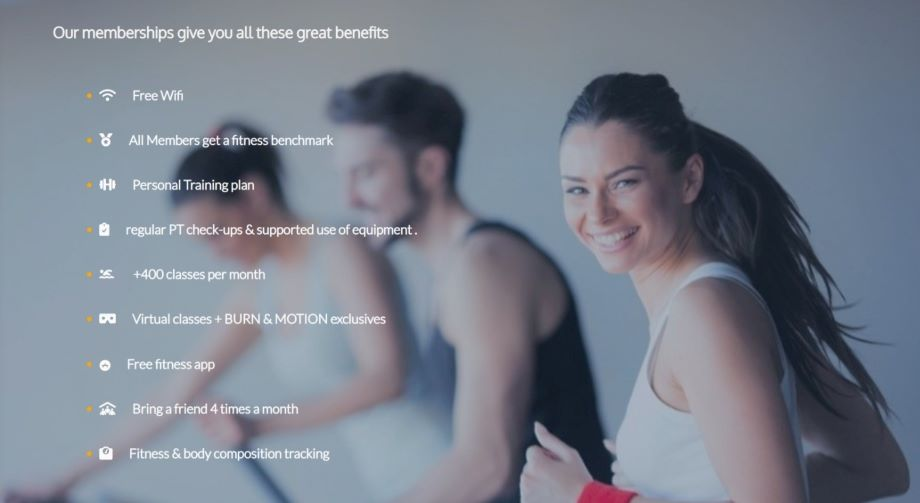
    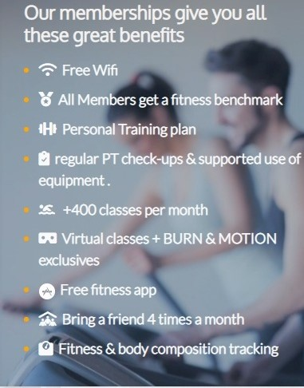
    * mobile view
   

  03.At top of third part there are there cards that Features three membership pricing and mentioned what is not include.and join buttons
    * After it there is a join or create account form positoned at middle of page and each input has an icon next to it.so for better readability. 
  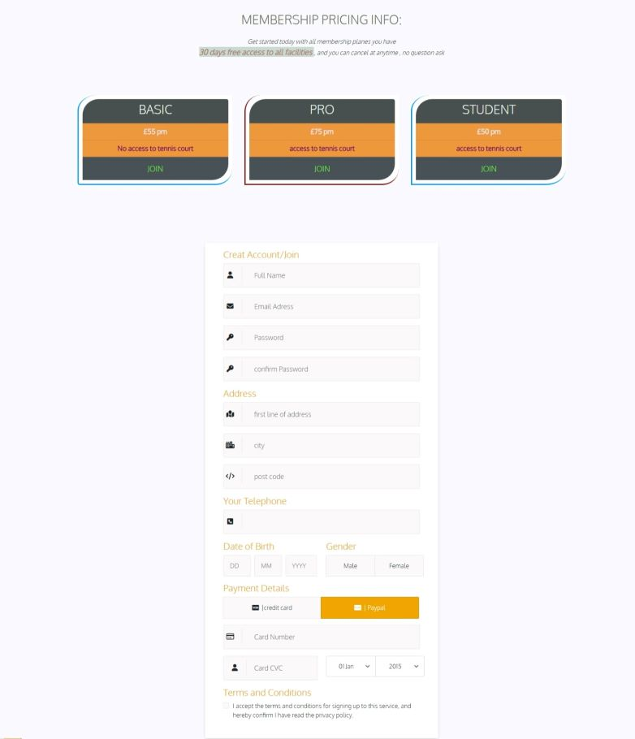
 
 #### join membership page desktop and mobile view
  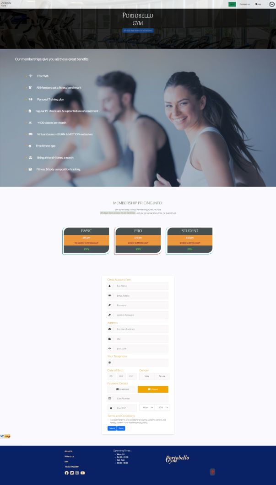   

  

 ### MAP PAGE
 
 * MAP page gives the user an interactive google map showing the location of the club along with details on full address in adequete size font to make it easily readable. By clicking the 'View larger map' link the user can go to the google maps site for the address - this opens in a separate tab to allow ease of navigation.
 and user find out about nearest satations and distance from the club.

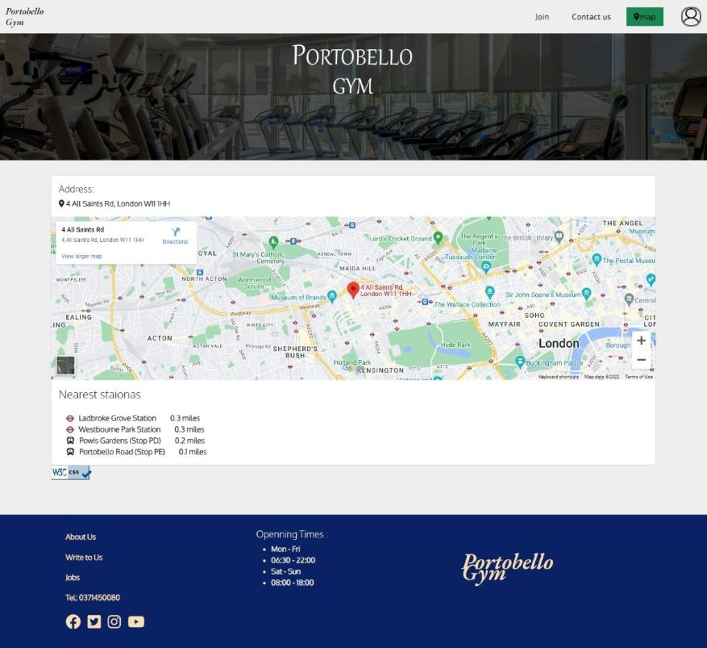 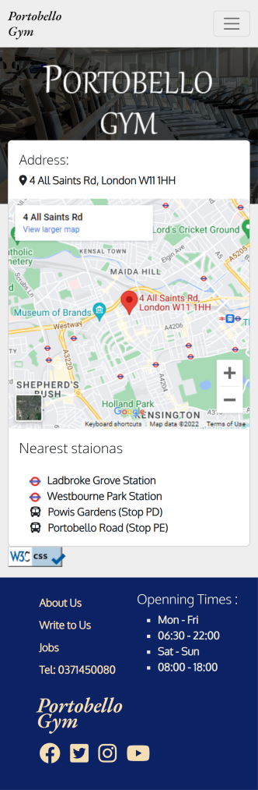 

  
  
  ### CONTACT US /navigaiton bar modal
  
  *  featured on all three pages and is identical on each page making it easy to use and for easey accessability place contact us in navbar and linked to modal form and request visitor  to enter  email, name and mobile number which are useful for future marketing campaign 
  , check boxs for contact reason and text area input for questions .
  
  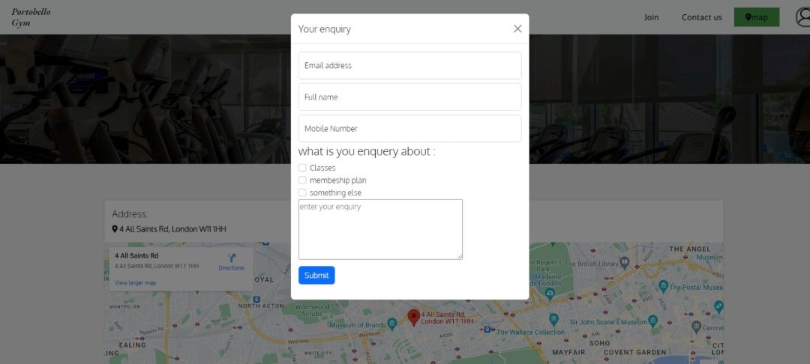
  
  
  ### login Page
  
  * with a simple login form and clean design and image background on mobile devices and orange color in full desktop mode,
  in the middle of page easily noticeable by visitor and all they need to do enter requeired details.
  
  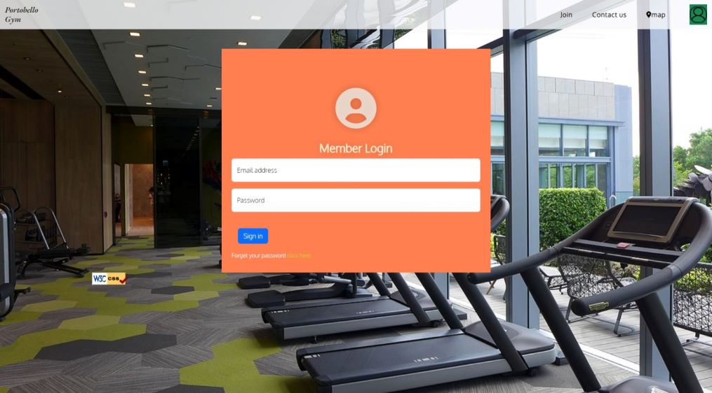 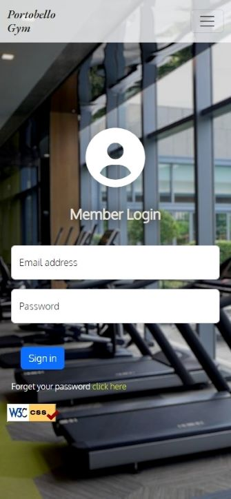 
 
 
  * mobile view
  
  
  
## Validator Testing

#### HTML pages
1. index.html
2. membership.html
3. map.html
4. login.html

* Testing result of html validator for all html pages was same  

 

#### CSS pages
1. index.css
2. membership.css
3. map.css
4. login.css

* Testing result for css files of all page

  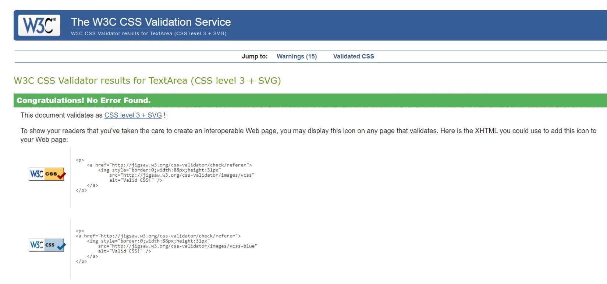

## Code sources
<ol>
<li> main source for coding the project pages used bootstrap then done some  changes by CSS 
map wich it was google provided codes

<ul>
<li><a href="https://getbootstrap.com/docs/5.2/components/modal/"  target=_blank>Bootstrap Modal </a></li>
<li><a href="https://getbootstrap.com/docs/5.2/components/card/">Bootstrap Card</a></li>
<li><a href="https://getbootstrap.com/docs/5.2/components/carousel/">Bootstrap Carousel</a> </li>
<li><a href="https://getbootstrap.com/docs/5.2/components/navbar/">Bootstrap Navbar</a> </li>

</ul>

<li>For map link and how to embed it use Google map sources from<a href="https://developers.google.com/maps/documentation/embed/get-started" target=_blank> this link</a></li>

<li>A Book used for coding was <a href="https://www.oreilly.com/library/view/learning-web-design/9781491960196/" target=_blank>learning web design</a> </li>

## Contributing
Contributions are what make the open source community such an amazing place to learn, inspire, and create. Any contributions you make are greatly appreciated.

If you have a suggestion that would make this better, please fork the repo and create a pull request. You can also simply open an issue with the tag "enhancement". 
Don't forget to give the project a star! Thanks again!

## Fork the Project
* Create your Feature Branch 
* Commit your Changes 
* Push to the Branch 
* Open a Pull Request
(back to top)

### Contact
* maisan hussein - @your_twitter 

Project Link: https://github.com/maisam2004/gym_portobello

